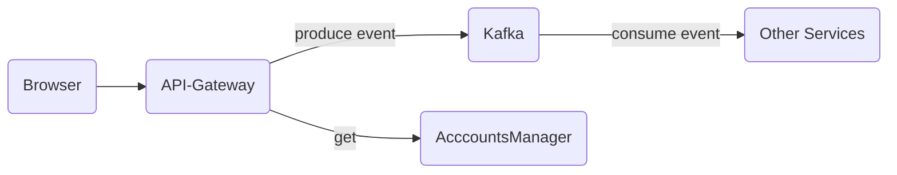

# Architecture

```mermaid
flowchart LR
    client(Browser)
    apigateway(API-Gateway)
    kafka(Kafka)
    accounts(AcccountsManager)
    services(Other Services)

    client --> apigateway
    apigateway -- produce event --> kafka
    apigateway -- get --> accounts
    kafka -- consume event --> services
    
```